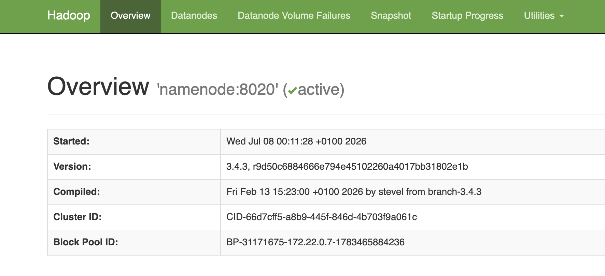
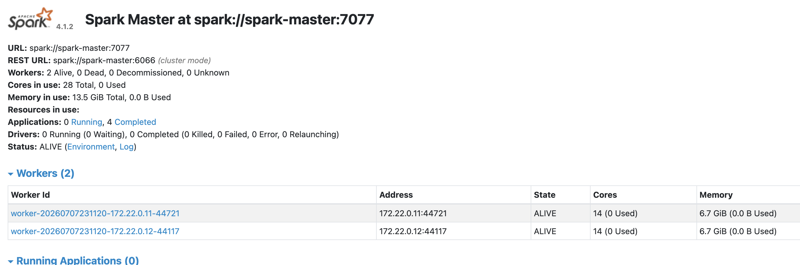
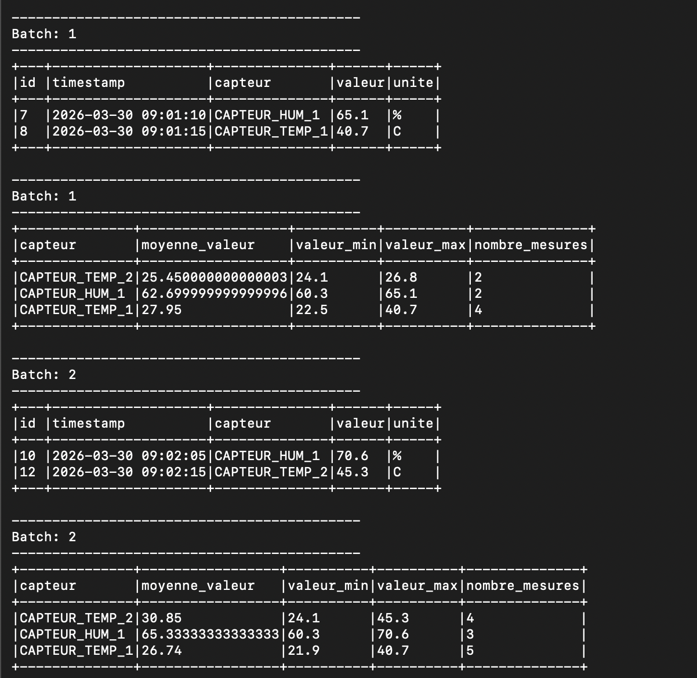

# TP 4 — Analyse en temps quasi réel des mesures de capteurs avec Spark Structured Streaming et HDFS

---

## Objectif du TP

L'objectif de ce TP est de construire une chaîne complète d'analyse de flux (_streaming_) reposant sur un cluster **Hadoop/HDFS** multi‑nœuds et un cluster **Spark** (master + workers), le tout orchestré avec **Docker Compose**.

---

## Guide d'exécution (via Docker)

##### 1. Démarrer le cluster

```bash
docker compose up -d
docker compose ps
```

Interfaces web :

- HDFS NameNode : http://localhost:9870



- Spark Master : http://localhost:8080



##### 2. Préparer HDFS

```bash
docker compose exec namenode hdfs dfs -mkdir -p /streaming/capteurs
docker compose exec namenode hdfs dfs -mkdir -p /streaming/checkpoints/capteurs_stats
docker compose exec namenode hdfs dfs -mkdir -p /streaming/checkpoints/capteurs_alertes

# Vérification
docker compose exec namenode hdfs dfs -ls /streaming
docker compose exec namenode hdfs dfs -ls /streaming/checkpoints
```

Pour repartir de zéro plus tard :

```bash
docker compose exec namenode hdfs dfs -rm -r "/streaming/capteurs/*"
docker compose exec namenode hdfs dfs -rm -r "/streaming/checkpoints/capteurs_stats/*"
docker compose exec namenode hdfs dfs -rm -r "/streaming/checkpoints/capteurs_alertes/*"
```

##### 3. Copier l'application dans le conteneur Spark

Depuis le dossier du TP sur votre machine :

```bash
docker cp app.py spark-master:/opt/spark/work-dir/app.py
```

##### 4. Lancer l'application

```bash
docker compose exec namenode hdfs dfs -chmod -R 777 /streaming

docker compose exec spark-master /opt/spark/bin/spark-submit \
  --master spark://spark-master:7077 \
  /opt/spark/work-dir/app.py
```

Laisser ce terminal ouvert : c'est ici que s'affichent les micro-batchs toutes les 10 secondes.

##### 5. Déposer progressivement les fichiers

Dans un **autre terminal**, copier les CSV dans le conteneur namenode puis les
pousser dans HDFS un par un, en observant la console Spark entre chaque dépôt :

```bash
docker cp data/capteurs_1.csv tp4-namenode-1:/tmp/
docker compose exec namenode hdfs dfs -put /tmp/capteurs_1.csv /streaming/capteurs/
# → observer la console Spark (batch 1)

docker cp data/capteurs_2.csv tp4-namenode-1:/tmp/
docker compose exec namenode hdfs dfs -put /tmp/capteurs_2.csv /streaming/capteurs/
# → l'alerte id=8 (40.7 C) apparaît

docker cp data/capteurs_3.csv tp4-namenode-1:/tmp/
docker compose exec namenode hdfs dfs -put /tmp/capteurs_3.csv /streaming/capteurs/
# → l'alerte id=12 (45.3 C) apparaît

docker compose exec namenode hdfs dfs -ls /streaming/capteurs
```

Résultat final attendu :



---

## Réponses aux questions de compréhension

**1. Pourquoi définir un schéma explicite en Structured Streaming ?**
Structured Streaming doit connaitre les types des colonnes avant de surveiller les fichiers. L'inference automatique est évitée pour garantir un traitement stable.

**2. Rôle du checkpoint ?**
Il conserve la progression, les offsets et l'état des agrégations. Au redémarrage, Spark reprend à partir de cet état.

**3. Différence entre append et complete ?**
Append écrit seulement les nouvelles lignes. Complete remplace ou réaffiche toute la table agrégée à chaque micro-batch.

**4. Pourquoi maxFilesPerTrigger ?**
Il limite ici le flux à un fichier par micro-batch afin de rendre les résultats progressifs et faciles à observer.

**5. Que se passe-t-il si on redémarre avec le même checkpoint ?**
Spark reconnait les fichiers déjà traités et reprend le calcul sans recommencer depuis zéro, sous reserve que la requete reste compatible.

**6. Pourquoi parle-t-on de traitement micro-batch ?**
Spark regroupe les nouvelles données recues pendant chaque intervalle de declenchement et execute un petit traitement batch répetitif.

**7. Quand Kafka est-il plus adapté que HDFS comme source ?**
Kafka est plus adapté aux évenements continus à faible latence, aux producteurs multiples et à la relecture de topics. HDFS convient bien à des fichiers déposés périodiquement.

**8. Comment enregistrer les statistiques dans HDFS au lieu de la console ?**
Pour des agregations mises à jour, utiliser foreachBatch avec outputMode("complete") puis écrire le DataFrame de chaque batch en Parquet dans un chemin HDFS.

**9. Différence batch classique vs Structured Streaming ?**
Le batch lit un jeu de données fermé une seule fois. Structured Streaming garde la requete active et traite les nouvelles données au fil de leur arrivée.

**10. Pourquoi le mode complete pour les agrégations ?**
Chaque groupe peut etre modifié par les nouvelles mesures. Le mode complete restitue donc une vue cohérente de tous les groupes apres chaque micro-batch.

---

## 3. Conclusion

Ce TP a permis de mettre en œuvre une chaîne complète d'analyse de flux de bout en bout : un cluster **HDFS** multi‑nœuds pour le stockage distribué et tolérant aux pannes, un cluster **Spark** pour le calcul distribué, et une application **Structured Streaming** capable de traiter les données en temps quasi réel.

---
