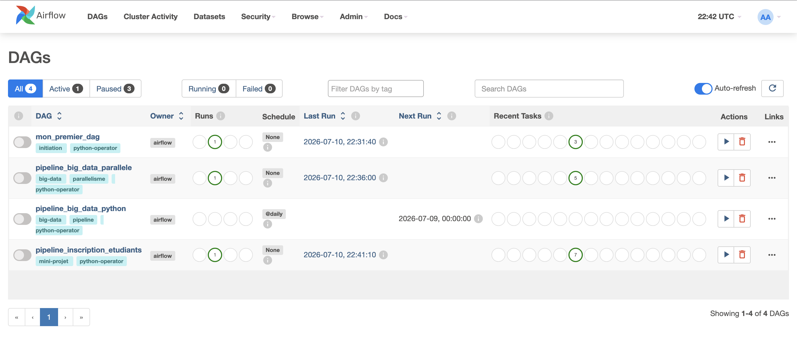
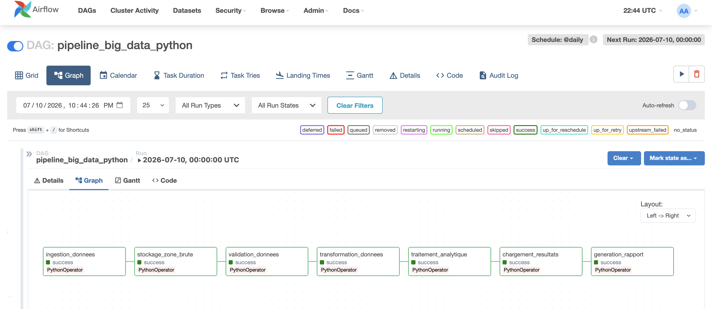
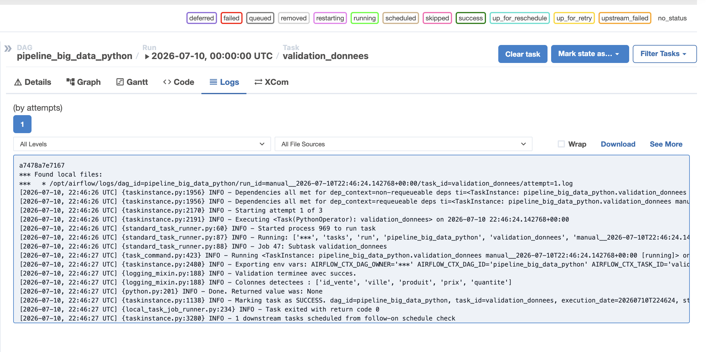

# TP 6 - Atelier Big Data — Apache Airflow pour l'orchestration des pipelines Big Data

---

## Objectif du TP

Ce TP a pour but de comprendre le rôle d'Apache Airflow dans une architecture Data Engineering.
Airflow n'est pas un moteur de traitement (comme Spark ou Flink) : c'est un orchestrateur qui définit, planifie, exécute et surveille des pipelines sous forme de DAGs (Directed Acyclic Graphs). Chaque DAG est composé de tâches (ici des `PythonOperator`) reliées par des dépendances qui déterminent l'ordre d'exécution.

---

## Structure du projet

```
TP6-atelier-airflow/
├── docker-compose.yaml
├── README.md
├── dags/
│   ├── mon_premier_dag.py
│   ├── pipeline_big_data_python.py
│   ├── pipeline_big_data_parallele.py
│   └── pipeline_inscription_etudiants.py
└── screenshots/
```

---

## Réponses aux questions

### Section 6 — DAG `pipeline_big_data_python`

1. **Première tâche exécutée :** `ingestion_donnees`.
2. **Dernière tâche exécutée :** `generation_rapport`.
3. **Tâche qui crée le fichier CSV brut :** `ingestion_donnees`.
4. **Tâche qui vérifie le schéma des données :** `validation_donnees`.
5. **Tâche qui calcule le chiffre d'affaires par ville :** `traitement_analytique`.
6. **Où voir les messages des fonctions Python :** dans les **logs** de chaque tâche, via l'interface Web (cliquer sur la tâche dans la vue Graph → onglet _Logs_). Les `print()` y apparaissent avec le préfixe `INFO`.

### Section 11 — DAG `pipeline_big_data_parallele`

1. **Tâches exécutées avant le parallélisme :** `preparation_donnees` puis `validation_donnees`.
2. **Tâches exécutées en parallèle :** `traitement_par_ville` et `traitement_par_produit`.
3. **Tâche qui attend la fin des deux traitements :** `generation_rapport_final`.
4. **Représentation dans la vue Graph :** après `validation_donnees`, le graphe se **divise en deux branches**, qui **convergent** ensuite vers `generation_rapport_final`.

---

## Captures d'écran

#### 1. Liste des DAGS



#### 2. Vue d'un `GRAPH`



#### 3. Logs d'une tâche



---
